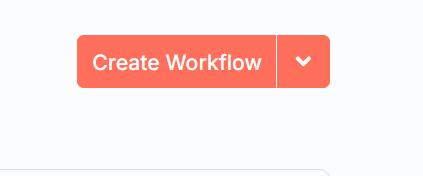
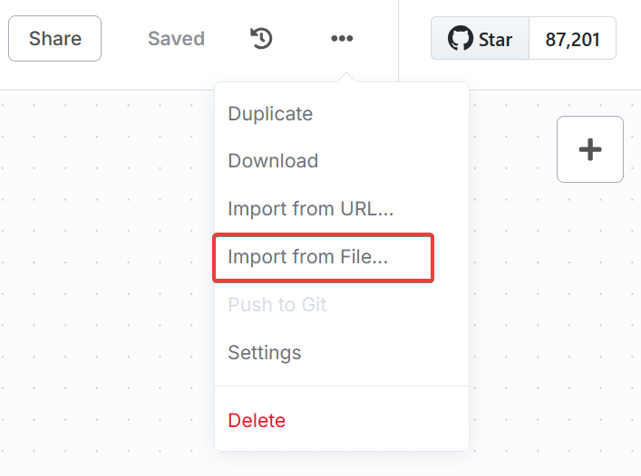

# AI, Automation, & Threat Modeling: Lessons Learned from Hacking the Planet​ by Doug Mckee and Ismael Valenzuela

## firmnightware

- clone the repository, set up the KEV database and run the streamlit app 
  ```bash
  git clone https://github.com/aboutsecurity/rsac2025.git  
  cd rsac2025/firmnightware
  python3 -m venv .venv
  pip install -r requirements.txt
  python3 download_kev.py # first download known exploit vulnerabilities, quit after the download there should be a cisa_vulnerabilities.db
  streamlit run firmnightware.py 
  ```
- Extract your image `binwalk -eM <image>` 
- Run cve-bin-tool using json2 output `cve-bin-tool -f json2 -o report <folder>`
- Import the report.json` file into the streamlit app

## Streamlit APP - firmnightware.py

### Prerequisites

- Configure Retool Workflow
- Set up the vector store and enable it in the workflow
- Configure the workflow webhook URL and API KEY in the streamlit app

This script creates a Streamlit web application for visualizing and analyzing vulnerability reports. It provides the following functionalities:

1. **Upload and Parse JSON Reports**: Allows users to upload JSON files containing vulnerability reports from cve-bin-tool 
2. **Display Metadata**: Extracts and displays metadata from the uploaded report, including tool information and generation date.
3. **Database Information**: Shows information about the database, such as the last update date and total entries.
4. **Vulnerabilities Summary**: Summarizes the vulnerabilities by severity and displays them in a table.
5. **CVE Lookup in CISA Database**: Looks up CVE numbers from the report in a local SQLite database and displays the results.
6. **Trigger Retool Workflow**: Allows users to submit CVE numbers to a Retool workflow for further analysis.
7. **Detailed Vulnerabilities Report**: Provides detailed information about vulnerabilities from different data sources within the report.

## Usage

```bash
streamlit run firmnightware.py

```
   
## download_kev.py

This script is designed to download and manage the CISA Known Exploited Vulnerabilities (KEV) feed. It performs the following tasks:

1. **Download the KEV Feed**: Fetches the JSON feed from the CISA website.
2. **Create a SQLite Database**: Sets up a SQLite database to store the vulnerabilities data.
3. **Populate the Database**: Inserts the vulnerabilities data into the database.
4. **Lookup CVE Entries**: Provides an interactive prompt to lookup specific CVE entries in the database.


## Usage

Run the script to download the KEV feed, populate the database, and interactively lookup CVE entries.

```bash
python download_kev.py
```

The database will be saved as `cisa_vulnerabilities.db`.

## n8n workflows

### Running n8n

n8n can be run **locally** or **in the cloud**:

- **Local Setup**:  
  It’s recommended to use the [Self-Hosted AI Starter Kit](https://docs.n8n.io/hosting/starter-kits/ai-starter-kit/).  
  This is a completely free option and a great way to get started.

- **Cloud Setup**:  
  To run workflows in the cloud, simply [create an account on n8n.io](https://n8n.io/).

### API Keys

The workflows will require you to input your own API keys:

- **OpenAI**: [Get your API key here](https://platform.openai.com/api-keys)
- **Rapid Risk Radar**: [Get your API key here](https://www.rapidriskradar.com/)
- **Microsoft OneDrive**: Enter your credentials when prompted.


### Import Workflows

In either local or remote setups, to leverage the workflows, create a new workflow by clicking the orange **"Create Workflow"** button in the upper left corner.  



In the new workflow, you will need to **"Import from file"** the workflows from the `n8n_workflows` directory of this repo.  
To do this, click on the three-dot menu in the top left of the newly created workflow and select **"Import from file"**.



